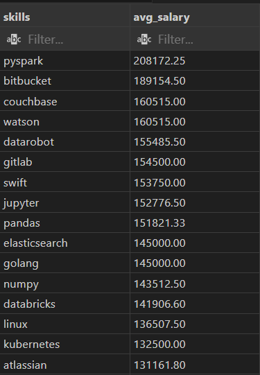
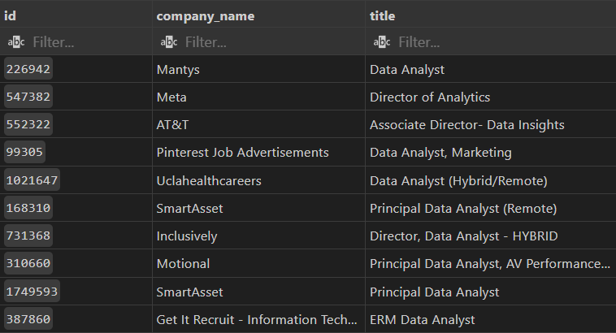
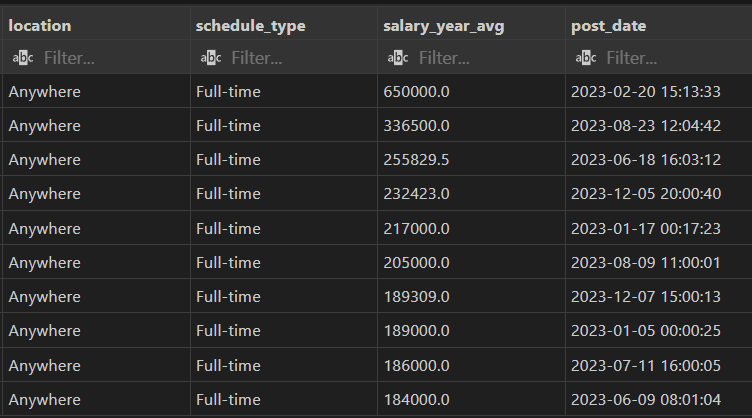
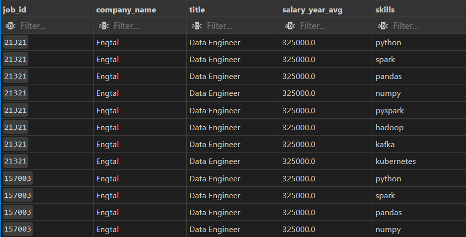
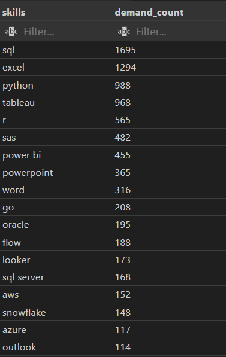
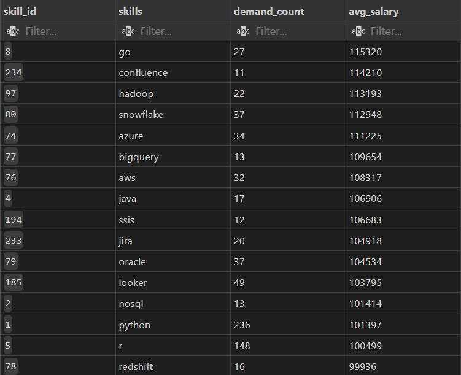

# Tools I Used

For my deep dive into the data analyst job market, I harnessed the power of several key tools:

- SQL: The backbone of my analysis, allowing me to query the database and unearth critical insights.

- PostgreSQL: The chosen database management system, ideal for handling the job posting data.

- Visual Studio Code: My go-to for database management and executing SQL queries.

- Git & GitHub: Essential for version control and sharing my SQL scripts and analysis, ensuring collaboration and project tracking.
   
   
-----------------------------------------------------------------------------------------------------------------------------------------------------------------------------------------------------------------
# 1) Top_Paying_Skills for Data Analysts

Overview:
 

This query identifies and highlights the top-paying skills for Data Analysts. It provides insights into the most in-demand technical and soft skills in the data analysis field, and how these skills can impact earning potential. The project includes data collection, analysis, visualization, and reporting of the findings.

Result visualization:

 
 
-----------------------------------------------------------------------------------------------------------------------------------------------------------------------------------------------------------------
# 2) Query: Top_Paying_Jobs for Data Analysts.

Overview:

This query aims to identify and analyze the highest-paying job roles for Data Analysts. By examining job listings, salary surveys, and industry reports, the project provides a comprehensive overview of the current job market and the roles that offer the most lucrative opportunities for Data Analysts.

Result visualization:

 
 
-----------------------------------------------------------------------------------------------------------------------------------------------------------------------------------------------------------------
# 3) Query: Top Paying Job Skills for Data Engineers.

Overview:

This query identifies and analyzes the top-paying skills for Data Engineers. By examining job listings, salary surveys, and industry reports, the project provides insights into the most lucrative technical and soft skills in the data engineering field, highlighting their impact on earning potential.

Result visualization:

 
 
-----------------------------------------------------------------------------------------------------------------------------------------------------------------------------------------------------------------
# 4) Top Demanded Skills for Data Analysts.

Overview:

This query identifies and analyzes the most in-demand skills for Data Analysts. By examining job listings, industry reports, and skill surveys, the project provides insights into the technical and soft skills that are highly sought after in the data analysis field. This analysis helps Data Analysts understand the skills they need to focus on to enhance their career prospects.

Result visualization:

-----------------------------------------------------------------------------------------------------------------------------------------------------------------------------------------------------------------
# 5) Most Optimal Skills for Data Analysts.

Overview:

This query identifies and analyzes the most optimal skills for Data Analysts. By examining job listings, industry reports, and skill surveys, the project provides insights into the technical and soft skills that are essential for Data Analysts to excel in their roles. This analysis helps Data Analysts focus on the skills that can significantly enhance their career development and job performance.

Result visualization:

-----------------------------------------------------------------------------------------------------------------------------------------------------------------------------------------------------------------
# What I Learned
Throughout this adventure, I've turbocharged my SQL toolkit with some serious firepower:
- 🧩 Complex Query Crafting: Mastered the art of advanced SQL, merging tables like a pro and wielding WITH clauses for ninja-level temp table maneuvers.
- 📊 Data Aggregation: Got cozy with GROUP BY and turned aggregate functions like COUNT() and AVG() into my data-summarizing sidekicks.
- 💡 Analytical Wizardry: Leveled up my real-world puzzle-solving skills, turning questions into actionable, insightful SQL queries.
-----------------------------------------------------------------------------------------------------------------------------------------------------------------------------------------------------------------
# Conclusion:
 This project enhanced my SQL skills and provided valuable insights into the data analyst job market. The findings from the analysis serve as a guide to prioritizing skill development and job search efforts.     
 Aspiring data analysts can better position themselves in a competitive job market by focusing on high-demand, high-salary skills. This exploration highlights the importance of continuous learning and adaptation 
 to emerging trends in the field of data analytics.
