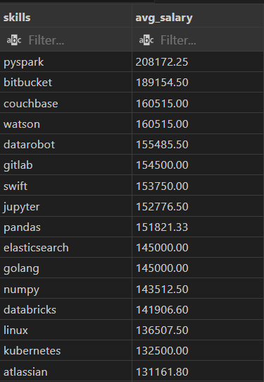

# Project: Data Analysis

# Top_Paying_Skills for Data Analysts

Overview:

This query identifies and highlights the top-paying skills for Data Analysts. It provides insights into the most in-demand technical and soft skills in the data analysis field, and how these skills can impact earning potential. The project includes data collection, analysis, visualization, and reporting of the findings.

Result visualization:

# 2) Query: Top_Paying_Jobs for Data Analysts.

Overview:

This project aims to identify and analyze the highest-paying job roles for Data Analysts. By examining job listings, salary surveys, and industry reports, the project provides a comprehensive overview of the current job market and the roles that offer the most lucrative opportunities for Data Analysts.

Result visualization:
